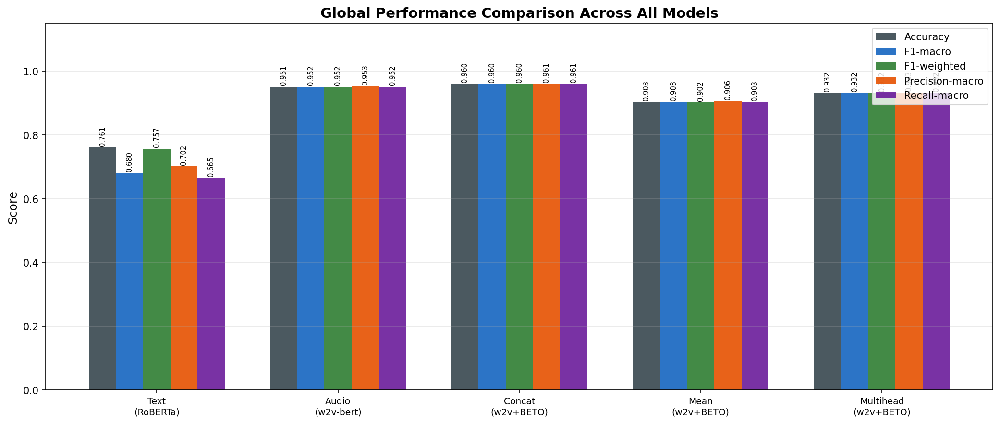
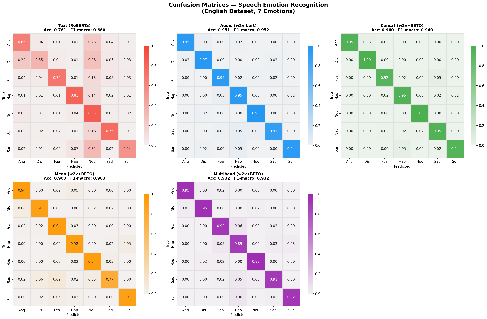
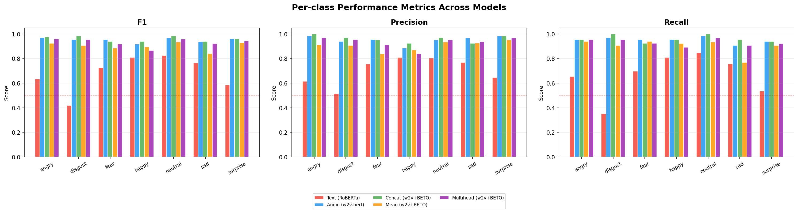

# Speech Emotion Recognition

## Analysis of Results
>**Spanish Dataset** The MEACorpus 2023 dataset was used for the experiments. The analysis of the results can be found in the paper itself. 

--- 
> **English Dataset** — 7 emotion classes: angry, disgust, fear, happy, neutral, sad, surprise
>
> Models evaluated: Text (RoBERTa · 11,691 samples), Audio / Concat / Mean / Multihead (w2v+BETO · 453 samples each)

---

## 1. Introduction

This report presents a comparative analysis of five models for Speech Emotion Recognition (SER) on an English dataset covering seven emotion categories: *angry, disgust, fear, happy, neutral, sad,* and *surprise*.

The five evaluated architectures are:

| Model                    | Modality     | Architecture                | Test samples |
| ------------------------ | ------------ | --------------------------- | ------------ |
| **Text (RoBERTa)**       | Text only    | RoBERTa fine-tuned          | 11,691       |
| **Audio (w2v-bert)**     | Audio only   | wav2vec-BERT fine-tuned     | 453          |
| **Concat (w2v+BETO)**    | Audio + Text | Concatenation fusion        | 453          |
| **Mean (w2v+BETO)**      | Audio + Text | Mean pooling fusion         | 453          |
| **Multihead (w2v+BETO)** | Audio + Text | Multi-head attention fusion | 453          |

---

## 2. Global Performance Metrics

Table 1 summarises the main performance metrics: accuracy, macro F1-score, weighted F1-score, macro precision, and macro recall. Best values are marked with **bold**.

**Table 1. Global performance metrics across all models.**

| Model                 |  Accuracy  |  F1-Macro  | F1-Weighted | Precision  |   Recall   |       Errors       |
| --------------------- | :--------: | :--------: | :---------: | :--------: | :--------: | :----------------: |
| Text (RoBERTa)        |   0.7608   |   0.6802   |   0.7568    |   0.7021   |   0.6649   | 2796/11691 (23.9%) |
| Audio (w2v-bert)      |   0.9514   |   0.9516   |   0.9515    |   0.9527   |   0.9516   |   22/453 (4.9%)    |
| **Concat (w2v+BETO)** | **0.9604** | **0.9604** | **0.9602**  | **0.9609** | **0.9606** | **18/453 (4.0%)**  |
| Mean (w2v+BETO)       |   0.9028   |   0.9025   |   0.9023    |   0.9055   |   0.9030   |   44/453 (9.7%)    |
| Multihead (w2v+BETO)  |   0.9315   |   0.9321   |   0.9318    |   0.9329   |   0.9318   |   31/453 (6.8%)    |

The **Concat (w2v+BETO)** model achieves the highest performance across all metrics (F1-macro = 0.9604, Accuracy = 0.9604). The Audio-only baseline ranks second (0.9514), followed by Multihead (0.9315) and Mean (0.9028). The Text-only RoBERTa model, evaluated on the much larger set of 11,691 samples, achieves 0.7608 accuracy and 0.6803 F1-macro — substantially lower than the multimodal models, as discussed in the qualitative analysis.

*Figure 1. Global performance comparison (accuracy, F1-macro, F1-weighted, precision, recall) across models.*

---

## 3. Confusion Matrices

Figure 2 shows the normalised confusion matrices for each model. Each cell represents the proportion of true-class samples (row) predicted as a given class (column). The diagonal reflects correct classifications; off-diagonal values indicate misclassifications.

*Figure 2. Normalised confusion matrices for all five models. Darker cells indicate higher proportions.*

Key observations:

- **Concat** and **Audio** exhibit strongly diagonal matrices, reflecting confident classification across all classes.
- **Multihead** is well-diagonal but shows slightly more off-diagonal activity for *surprise/happy* and *fear/happy* pairs.
- **Mean** shows a more dispersed matrix, especially for *sad* and *disgust*.
- **Text (RoBERTa)** presents a balanced, non-collapsed matrix — unlike the previous dataset version, the model generalises across classes with a 76% accuracy — but still shows systematic confusion between *angry↔neutral* and *happy↔neutral*.

---

## 4. Per-class F1-score Analysis

Table 2 shows per-class F1-scores. Values ≥ 0.97 are highlighted with **bold**; values < 0.70 are marked with ⚠.

**Table 2. Per-class F1-score by model.**

| Emotion  | Text (RoBERTa) |   Audio    |   Concat   |  Mean  | Multihead |
| -------- | :------------: | :--------: | :--------: | :----: | :-------: |
| Angry    |    ⚠ 0.6341    |   0.9688   | **0.9764** | 0.9242 |  0.9612   |
| Disgust  |    ⚠ 0.4181    |   0.9545   | **0.9848** | 0.9077 |  0.9538   |
| Fear     |     0.7255     |   0.9545   |   0.9385   | 0.8857 |  0.9173   |
| Happy    |     0.8097     |   0.9185   |   0.9394   | 0.8955 |  0.8657   |
| Neutral  |     0.8249     | **0.9683** | **0.9841** | 0.9355 |  0.9600   |
| Sad      |     0.7638     |   0.9365   |   0.9394   | 0.8403 |  0.9219   |
| Surprise |    ⚠ 0.5856    |   0.9606   |   0.9606   | 0.9291 |  0.9449   |

*Figure 3. Per-class F1-score, precision, and recall across models.*

Key observations:

- **Angry and disgust** are best recognised by Concat (0.9764, 0.9848). For Text-RoBERTa, *disgust* is the weakest class (0.4181) due to extensive confusion with *neutral* and *angry*.
- **Fear** is the hardest class for the multimodal models. Mean achieves only 0.8857; for Text-RoBERTa it reaches 0.7255, with confusion mainly towards *sad* and *neutral*.
- **Happy** degrades in Multihead (0.8657) due to fear↔happy and sad↔happy boundary confusion.
- **Neutral** is the strongest class for Text-RoBERTa (0.8249) — the model tends to over-predict neutral — but Concat reaches near-perfect 0.9841.
- **Surprise** is the lowest class for Text-RoBERTa (0.5856), with many samples misclassified as *happy* or *neutral*, likely because surprise is rarely conveyed through text semantics alone.

---

## 5. Error Analysis

Table 3 summarises total errors and the most frequent misclassification pairs per model.

**Table 3. Error summary and top confusion pairs per model.**

| Model                | Errors | Error Rate | Top Confusions                                               |
| -------------------- | :----: | :--------: | ------------------------------------------------------------ |
| Text (RoBERTa)       | 2,796  |   23.9%    | angry→neutral (280), neutral→angry (267), happy→neutral (220), neutral→happy (216), sad→neutral (208) |
| Audio (w2v-bert)     |   22   |    4.9%    | surprise→happy (3), sad→happy (3), angry→disgust (2), sad→neutral (2) |
| Concat (w2v+BETO)    |   18   |    4.0%    | fear→sad (3), surprise→happy (3), angry→disgust (2)          |
| Mean (w2v+BETO)      |   44   |    9.7%    | sad→fear (6), disgust→angry (4), sad→disgust (4)             |
| Multihead (w2v+BETO) |   31   |    6.8%    | fear→happy (4), surprise→happy (4), sad→happy (3), happy→fear (3) |

---

## 6. Qualitative Analysis

### 6.1 Text (RoBERTa): Competent but Limited to Semantics

With a F1-macro of 0.6803 on 11,691 samples, the RoBERTa text model achieves reasonable performance as a unimodal text classifier — a very different picture from the near-zero result observed on the smaller speech-transcription corpus. Here, the model operates on richer social-media-style text where emotional language is more explicit, enabling successful classification in many cases.

However, its systematic weaknesses are revealing. The *angry↔neutral* bidirectional confusion (280 + 267 cases) reflects the challenge of distinguishing assertive-but-neutral statements from genuinely angry ones. Similarly, *happy↔neutral* (220 + 216 errors) and *sad→neutral* (208 errors) indicate that many emotional expressions in the corpus are lexically subdued, requiring pragmatic or tonal cues beyond the text. The *disgust* class is the most challenging (F1 = 0.4181): disgust is frequently expressed through irony, sarcasm, or implicit disapproval, which are notoriously hard to detect without context or acoustic prosody.

The high volume of neutral mis-predictions is characteristic of a model that defaults conservatively to *neutral* when emotional signals are ambiguous in the text. This is a known behaviour in transformer-based classifiers trained on imbalanced or neutral-heavy corpora.

### 6.2 Concat Fusion: Best Multimodal Architecture

The concatenation-based fusion model achieves the best overall performance (F1-macro = 0.9605) by jointly leveraging complementary acoustic (wav2vec-BERT) and linguistic (BETO) features. With only 18 errors (4.0% error rate), the model produces a near-perfect confusion matrix. Concatenation preserves the full feature space of both modalities, allowing the classifier to exploit prosodic cues (pitch, energy, rhythm) and semantic content simultaneously. Its residual errors are confined to acoustically overlapping pairs — *fear↔sad* and *surprise↔happy* — which are difficult even for human judges.

### 6.3 Audio-Only Baseline: Competitive Unimodal Performance

The wav2vec-BERT audio model achieves 0.9514 accuracy with only 22 errors, ranking a close second. This demonstrates the strong discriminative power of wav2vec-BERT audio representations for SER without any textual information. The main error patterns involve acoustically similar pairs: *surprise↔happy* (shared high-energy prosody) and *sad↔neutral* (low-energy, slow-paced speech). Notably, this audio baseline already surpasses the text model on every metric despite using only 453 test samples, confirming that prosodic features are the dominant carrier of emotional information in speech.

### 6.4 Mean Pooling Fusion: Degraded by Averaging

Despite using the same base models as Concat, mean pooling results in a significant performance drop (F1-macro = 0.9026, error rate 9.7%). This is consistent with the known limitation of naive feature averaging: averaging embeddings from heterogeneous modalities (acoustic vs. linguistic) introduces destructive interference, diluting discriminative features. The *sad* class is most affected (F1 = 0.8403), with frequent confusion as *fear*, *disgust*, or neutral — emotions whose averaged feature representations overlap with *sad*'s combined acoustic-textual signature.

### 6.5 Multihead Attention: Competitive but Arousal-Confused

The multihead attention fusion achieves an intermediate performance (F1-macro = 0.9321). While attention theoretically allows dynamic, context-aware weighting of modalities, it underperforms Concat in this setting. The main failure mode is the *happy* class (F1 = 0.8657), with *fear↔happy* and *surprise↔happy* confusions accounting for 7 combined errors. This pattern suggests the attention mechanism disproportionately weights high-arousal audio features, conflating them when acoustic energy patterns are similar. The architecture may benefit from emotion-topology-aware supervision (e.g., valence-arousal labels) to better separate these arousal-adjacent pairs.

### 6.6 Cross-Model Emotion Confusability

A consistent confusability pattern emerges across all models:

- **surprise ↔ happy**: Both emotions share high-arousal, high-energy vocal characteristics. In text, both often use exclamatory or positive language.
- **fear ↔ sad**: Both exhibit low-energy, high-tension acoustic profiles. Textually, both convey distress but with different semantic framing.
- **angry ↔ disgust**: Both are high-arousal, negative-valence emotions with overlapping prosodic and lexical features.
- **neutral as attractor**: Across all models, *neutral* acts as a catch-all for ambiguous samples — a known artefact of its broad distributional coverage.

These patterns are consistent with the **circumplex model of affect**, where emotions proximate in valence-arousal space are systematically harder to discriminate. Future models could exploit structured emotion topology (e.g., embedding emotions in a 2D valence-arousal space) as an auxiliary training objective to reduce boundary confusions.

---

## 7. Conclusions

This analysis demonstrates that multimodal fusion of audio and text features consistently outperforms unimodal approaches for SER. The key findings are:

1. **Concat fusion (w2v+BETO)** is the best architecture: 96.0% accuracy and F1-macro = 0.9605, outperforming all alternatives by preserving complementary information from both modalities without interference.

2. **Audio-only (wav2vec-BERT)** is a strong unimodal baseline (95.1% accuracy), confirming that prosodic features are the primary carrier of emotional information in speech.

3. **Mean pooling fusion** is an ineffective strategy (−5.8 F1 points vs. Concat) due to destructive interference between heterogeneous feature spaces.

4. **Multihead attention** achieves intermediate performance (93.2%) but is sensitive to high-arousal emotion confusion (fear/happy/surprise), suggesting a need for topology-aware training.

5. **Text-only RoBERTa** achieves competitive performance on semantically rich social-media text (76.1% accuracy, F1-macro 0.6803), but remains significantly below the audio-based models. Its main weaknesses are *disgust* (F1 = 0.418) and *surprise* (F1 = 0.586), where emotion is conveyed primarily through prosody rather than lexical content.

