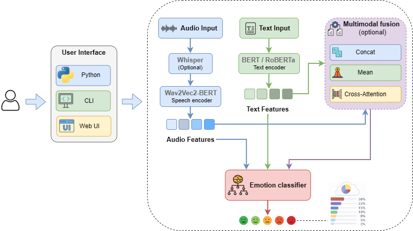
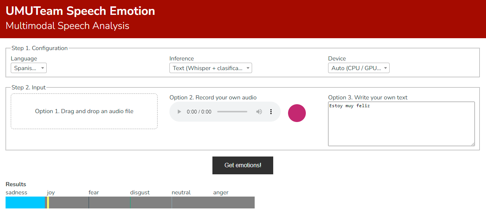

# Speech Emotion

`speech-emotion` is a lightweight Python package for emotion recognition from audio and text.  
It supports Spanish (`es`) and English (`en`) and provides several inference modes:

- **text** – Whisper transcription + text classifier  
- **audio** – Wav2Vec2-BERT audio classifier  
- **concat** – Multimodal fusion (audio + text) by concatenation  
- **mean** – Multimodal fusion by mean  
- **multihead** – Multimodal fusion using multi-head cross-attention  




## UMUTeam Models – Training Details & Performance

All models were trained by UMUTeam using multilingual and multimodal corpora. Below is a summary for transparency and reproducibility.

### Spanish Models

**Dataset**: **Spanish MEACorpus 2023** (speech + transcripts, natural environments)
 Used for all modes:

- Speech-only
- Text-only
- Multimodal

#### Test Performance

| Mode      | Acc.       | W-Precision | W-F1  | Macro-F1  |
| --------- | ---------- | ----------- | ----- | --------- |
| Speech    | **88.12%** | 88.32       | 88.14 | 84.48     |
| Text      | 77.02%     | 77.04       | 76.83 | 69.38     |
| Concat    | **90.06%** | 90.20       | 90.06 | **87.74** |
| Mean      | 88.51%     | 88.61       | 88.50 | 84.16     |
| Multihead | 82.66%     | 82.38       | 82.46 | 75.56     |

### English Models

#### Datasets (speech)

Merged and normalized:

- **RAVDESS**
- **TESS**
- **SAVEE**

#### Datasets (text-only)

- **DAIR-AI Emotion**
- **GoEmotion**
- **ISEAR**
- **MELD**

#### Test Performance

| Mode      | Acc.       | W-Precision | W-F1  | Macro-F1  |
| --------- | ---------- | ----------- | ----- | --------- |
| Speech    | **95.14%** | 95.27       | 95.15 | 95.16     |
| Text      | 76.08%     | 75.57       | 75.68 | 68.02     |
| Concat    | **96.04%** | 96.08       | 96.02 | **96.04** |
| Mean      | 90.28%     | 90.51       | 90.23 | 90.25     |
| Multihead | 93.15%     | 93.27       | 93.18 | 93.21     |

### Dataset distribution 

| Language    | Modality   | Datasets Used                           | Train  | Val.   | Test   |
| ----------- | ---------- | --------------------------------------- | ------ | ------ | ------ |
| **Spanish** | Speech     | Spanish MEACorpus 2023                  | 3,692  | 410    | 1,027  |
|             | Text       | Spanish MEACorpus 2023                  | 3,692  | 410    | 1,027  |
|             | Multimodal | Spanish MEACorpus 2023                  | 3,692  | 410    | 1,027  |
| **English** | Speech     | RAVDESS, TESS, SAVEE                    | 3,622  | 453    | 453    |
|             | Text       | DAIR-AI Emotion, GoEmotion, ISEAR, MELD | 93,525 | 11,691 | 11,691 |
|             | Multimodal | RAVDESS, TESS, SAVEE                    | 3,622  | 453    | 453    |


## Installation

Clone the repository and install in editable mode:

```bash
git clone https://github.com/NLP-UMUTeam/umuteam-speech-emotion
pip install -e .
```

This installs: 

- The python package `speech_emotion`
- The command-line tool `speech_emotion`

## Supported Emotions

### Spanish (6 labels)

```
anger, disgust, fear, joy, neutral, sadness
```

### English (7 labels)

```
angry, disgust, fear, happy, neutral, sad, surprise
```

## Command Line Usage

 ### Show help

```
speech-emotion -h
```

### Basic example (Spanish, text mode)

```
speech-emotion \
  --audio path/to/audio.wav \
  --language es \
  --mode text \
  --model-config model.json
```

or Text-only usage (no audio, no Whipser for transcription)

```
speech-emotion \
  --text "I am very happy today" \
  --language en \
  --mode text \
  --model-config model.json
```

### Audio-only (Wav2Vec2-BERT, English)

```
speech-emotion \
  --audio audio.wav \
  --language en \
  --mode audio \
  --model-config model.json
```

### Multimodal concat fusion

```
speech-emotion \
  --audio audio.wav \
  --language es \
  --mode concat \
  --model-config model.json
```

### Multimodal mean fusion

```
speech-emotion \
  --audio audio.wav \
  --language en \
  --mode mean \
  --model-config model.json
```

### Multimodal multi-head cross-attention fusion

```
speech-emotion \
  --audio audio.wav \
  --language es \
  --mode multihead \
  --model-config model.json
```

### Multimodal with external transcript

For multimodal modes, you can pass both audio and a precomputed transcript.  If `--text` is provided, Whisper is skipped and the given text is used:

```
speech-emotion \
  --audio audio.wav \
  --text "Estoy muy contento hoy" \
  --language es \
  --mode concat \
  --model-config model.json
```

##  Using speech-emotion inside a Python script (without CLI)

Besides the command-line interface, you can use the full API directly from Python. This is useful when integrating the system into larger pipelines, notebooks, or backend services.

### Basic Example (Text Mode)

```python
from speech_emotion import predict_emotion

emotion = predict_emotion(
    text="I am very happy today",
    language="en",
    mode="text",
    model_config_path="model.json"
)

print("Detected emotion:", emotion)
```

### Audio-only Example (Wav2Vec2-BERT)

```python
from speech_emotion import predict_emotion

emotion = predict_emotion(
    audio_path="audio.wav",
    language="es",
    mode="audio",
    model_config_path="model.json"
)

print("Emotion:", emotion)
```

### Using Whisper transcription automatically (multimodal setting)

```python
from speech_emotion import predict_emotion

emotion = predict_emotion(
    audio_path="audio.wav",
    language="en",
    mode="concat",
    model_config_path="model.json"
)

print(emotion)
```

### Minimal Script Template (You can include this in your repo)

```
# run_inference.py
from speech_emotion.inference import predict_emotion
import argparse

if __name__ == "__main__":
    p = argparse.ArgumentParser()
    p.add_argument("--audio")
    p.add_argument("--text")
    p.add_argument("--language", default="en")
    p.add_argument("--mode", default="text")
    p.add_argument("--device")
    p.add_argument("--model-config", default="model.json")

    args = p.parse_args()

    emotion = predict_emotion(
        audio_path=args.audio,
        text=args.text,
        language=args.language,
        mode=args.mode,
        device=args.device,
        model_config_path=args.model_config
    )

    print("Emotion detected:", emotion)
```

## Model Configuration 

Models are organized in a simple JSON file (`model.json`).
Each language defines the HuggingFace model IDs used for each inference mode.

The system uses **pretrained models developed by the UMUTeam**, which are published and available on **HuggingFace**.

```json
{
  "es": {
    "text": "UMUTeam/MarIA-emotion-es",
    "audio": "UMUTeam/w2v-bert-emotion-es",
    "concat": "UMUTeam/w2v-bert-beto-concat-emotion-es",
    "mean": "UMUTeam/w2v-bert-beto-mean-emotion-es",
    "multihead": "UMUTeam/w2v-bert-beto-multihead-emotion-es"
  },
  "en": {
    "text": "UMUTeam/roberta-emotion-en",
    "audio": "UMUTeam/w2v-bert-emotion-en",
    "concat": "UMUTeam/w2v-bert-beto-concat-emotion-en",
    "mean": "UMUTeam/w2v-bert-beto-mean-emotion-en",
    "multihead": "UMUTeam/w2v-bert-beto-multihead-emotion-en"
  }
}

```

## GPU Usage 

The system can run on CPU or GPU. You can control the device in two ways:

1.  **Automatically using CUDA**: If a GPU is available, the library will automatically use.

2. **Selecting the GPU with CUDA_VISIBLE_DEVICES**: To force the model to use only one GPU.

   ```
   CUDA_VISIBLE_DEVICES=0 speech-emotion \
     --audio audio.wav \
     --language en \
     --mode audio \
     --model-config model.json
   ```

3. **Passing the device manually through the CLI**

   ```
   speech-emotion \
     --audio audio.wav \
     --language es \
     --mode text \
     --device cuda:0 \
     --model-config model.json
   ```

## Repository Structure

```
speech_emotion/
│
├── model.json
├── README.md
├── pyproject.toml
├── src/
│   └── speech_emotion/
│       ├── cli.py
│       ├── inference.py
│       ├── config.py
│       ├── model_registry.py
│       ├── __init__.py
│       └── models/
│           ├── wav2vec2_bert_es.py
│           ├── wav2vec2_bert_en.py
│           ├── multimodal_es.py
│           ├── multimodal_en.py
│           ├── multimodal_multi_head_cross_attn_es.py
│           └── multimodal_multi_head_cross_attn_en.py

```

## Interface
A web interface has been developed using FlaskAPI. This interface is located under the folder ```interface```

To start the interface, run (adjusting the port to your server)

```
cd interface
uvicorn server:app --host 0.0.0.0 --port 9999 --reload
```

A screen capture of the interface is shown below:
